# AbilityPay Protocol - System Architecture

## Executive Summary

The AbilityPay Protocol is a blockchain-agnostic payment system for NDIS (National Disability Insurance Scheme) that tokenizes participant budgets as programmable "smart money" while maintaining fiat currency settlement through multiple payment channels including Australia's New Payments Platform (NPP), Coinbase Commerce, and direct Ethereum blockchain transactions via MetaMask.

## System Overview

```mermaid
graph TB
    subgraph Frontend["Frontend Layer (Next.js/React)"]
        ParticipantUI[Participant Dashboard]
        ProviderUI[Provider Portal]
        PlanManagerUI[Plan Manager Interface]
        AdminUI[NDIA Admin Interface]
        MetaMaskUI[MetaMask Integration]
    end

    subgraph API["API Layer (Next.js API Routes)"]
        PlanAPI[Plan Management API]
        TokenAPI[Tokenization API]
        PaymentAPI[Payment Processing API]
        RedemptionAPI[Redemption API]
        AuditAPI[Audit & Reporting API]
        WalletAPI[Wallet Operations API]
        CoinbaseAPI[Coinbase Payment API]
    end

    subgraph Business["Business Logic Layer"]
        PlanService[Plan Service]
        TokenService[Token Service]
        PaymentService[Payment Service]
        ValidationService[Rule Validation Service]
        RedemptionService[Redemption Service]
    end

    subgraph Blockchain["Blockchain Abstraction Layer"]
        BCAdapter[Blockchain Adapter Interface]
        EthereumImpl[Ethereum Implementation]
        EthereumDLT[Ethereum DLT Service]
        HyperledgerImpl[Hyperledger Implementation]
        PolygonImpl[Polygon Implementation]
        MockImpl[Mock/Test Implementation]
    end

    subgraph Wallet["Wallet Integration"]
        MetaMaskAdapter[MetaMask Adapter]
        WalletUtils[Wallet Utilities]
    end

    subgraph Payment["Payment Provider Layer"]
        PaymentProvider[Payment Provider Service]
        NPPAdapter[NPP Adapter]
        CoinbaseAdapter[Coinbase Adapter]
        SettlementService[Settlement Service]
    end

    subgraph Data["Data Layer"]
        PostgreSQL[(PostgreSQL Database)]
        PrismaORM[Prisma ORM]
        Cache[(Redis Cache - Optional)]
    end

    subgraph External["External Services"]
        NDISPortal[NDIS Portal Integration]
        PriceGuide[NDIS Price Guide API]
        ProviderRegistry[Provider Registry]
        EthereumNetwork[Ethereum Network]
        CoinbaseCommerce[Coinbase Commerce]
        NPPNetwork[NPP Network]
    end

    subgraph Security["Security Layer"]
        Auth[NextAuth Authentication]
        Authorization[Authorization Utils]
        Sanitization[Input Sanitization]
        TransactionSecurity[Transaction Security]
        RateLimiting[Rate Limiting]
    end

    ParticipantUI --> PlanAPI
    ProviderUI --> PaymentAPI
    PlanManagerUI --> PlanAPI
    AdminUI --> AuditAPI
    MetaMaskUI --> WalletAPI

    PlanAPI --> PlanService
    TokenAPI --> TokenService
    PaymentAPI --> PaymentService
    RedemptionAPI --> RedemptionService
    WalletAPI --> MetaMaskAdapter
    CoinbaseAPI --> CoinbaseAdapter

    PlanService --> PostgreSQL
    TokenService --> BCAdapter
    PaymentService --> ValidationService
    PaymentService --> PaymentProvider
    ValidationService --> PriceGuide
    ValidationService --> ProviderRegistry
    RedemptionService --> PaymentProvider

    BCAdapter --> EthereumImpl
    BCAdapter --> HyperledgerImpl
    BCAdapter --> PolygonImpl
    BCAdapter --> MockImpl
    EthereumImpl --> EthereumDLT
    EthereumDLT --> EthereumNetwork

    PaymentProvider --> NPPAdapter
    PaymentProvider --> CoinbaseAdapter
    NPPAdapter --> NPPNetwork
    CoinbaseAdapter --> CoinbaseCommerce
    SettlementService --> NPPAdapter

    MetaMaskAdapter --> EthereumDLT
    WalletUtils --> MetaMaskAdapter

    PlanService --> NDISPortal
    PaymentService --> Cache
    RedemptionService --> Cache

    PlanAPI --> Auth
    PaymentAPI --> Authorization
    PaymentAPI --> TransactionSecurity
    PaymentAPI --> Sanitization
    AuditAPI --> Authorization
```



## Architecture Layers

### 1. Frontend Layer

**Technology Stack:**
- Next.js 14+ (App Router)
- React 18+
- TypeScript
- Tailwind CSS
- shadcn/ui components

**Components:**
- **Participant Dashboard**: Plan overview, spending history, payment initiation
- **Provider Portal**: Payment receipts, redemption requests, service delivery
- **Plan Manager Interface**: Multi-participant management, budget allocation
- **Admin Dashboard**: System-wide audit, compliance reporting, fraud detection
- **MetaMask Integration**: Wallet connection, transaction signing UI

**Key Features:**
- Server-side rendering (SSR)
- Client-side interactivity with React hooks
- Real-time updates via API polling
- Responsive design for mobile/desktop

### 2. API Layer

**Technology Stack:**
- Next.js API Routes
- NextAuth for authentication
- Zod for request validation
- Custom middleware for security

**Endpoints:**

#### Plan Management
- `POST /api/abilitypay/plans` - Create NDIS plan
- `GET /api/abilitypay/plans/[id]` - Get plan details
- `PUT /api/abilitypay/plans/[id]/budget` - Update budget
- `GET /api/abilitypay/plans/[id]/categories` - List categories

#### Tokenization
- `POST /api/abilitypay/tokens/mint` - Tokenize budget category
- `GET /api/abilitypay/tokens/[id]` - Get token details
- `GET /api/abilitypay/tokens/[id]/balance` - Query balance
- `POST /api/abilitypay/tokens/[id]/validate` - Validate rules

#### Payments
- `POST /api/abilitypay/payments` - Initiate payment (blockchain/coinbase/metamask)
- `GET /api/abilitypay/payments/[id]` - Get payment status
- `POST /api/abilitypay/payments/[id]/execute` - Execute payment
- `POST /api/abilitypay/payments/coinbase` - Coinbase payment
- `POST /api/abilitypay/payments/metamask` - MetaMask payment

#### Redemptions
- `POST /api/abilitypay/redemptions` - Request redemption
- `GET /api/abilitypay/redemptions/[id]` - Get redemption status
- `POST /api/abilitypay/redemptions/[id]/process` - Process redemption (admin)

#### Wallet Operations
- `POST /api/abilitypay/wallet/metamask` - Validate/process transactions
- `GET /api/abilitypay/wallet/metamask` - Get transaction status/balance

#### Audit & Reporting
- `GET /api/abilitypay/audit/transactions` - Query transaction log
- `GET /api/abilitypay/audit/plans/[id]` - Plan audit trail
- `GET /api/abilitypay/audit/compliance` - Compliance reports
- `GET /api/abilitypay/audit/fraud-detection` - Fraud indicators

### 3. Business Logic Layer

#### Plan Service
**Responsibilities:**
- Create and manage NDIS plans
- Allocate budgets across support categories
- Validate plan eligibility and status
- Integrate with NDIS verification system

**Key Methods:**
- `createPlan()` - Create plan from NDIS data
- `getPlan()` - Retrieve plan with budget breakdown
- `updateBudget()` - Adjust allocations
- `validatePlanActive()` - Check plan is active

#### Token Service
**Responsibilities:**
- Tokenize budget categories as blockchain vouchers
- Mint tokens with embedded spending rules
- Track token lifecycle (mint, transfer, burn)
- Interface with blockchain abstraction layer

**Key Methods:**
- `tokenizeCategory()` - Mint tokens for budget category
- `getTokenBalance()` - Query blockchain for balance
- `validateTokenRules()` - Check spending eligibility
- `transferToken()` - Execute blockchain transfer

#### Payment Service
**Responsibilities:**
- Process service purchase requests
- Validate against NDIS rules
- Execute payments via multiple channels:
  - Blockchain token transfers
  - Coinbase Commerce
  - MetaMask direct transactions
- Record transactions immutably

**Key Methods:**
- `initiatePayment()` - Start payment flow
- `validatePayment()` - Check all rules before execution
- `executePayment()` - Complete payment via selected channel
- `getTransactionHistory()` - Query transaction records

#### Validation Service
**Responsibilities:**
- Enforce NDIS price guide compliance
- Verify provider registration and service eligibility
- Check budget category restrictions
- Validate time-based constraints
- Verify worker NDIS certification

**Key Methods:**
- `validatePriceGuide()` - Check against NDIS price guide
- `validateProvider()` - Verify provider can deliver service
- `validateCategoryRules()` - Check category allows service
- `validateTimeConstraints()` - Check plan is active
- `validateWorkerNDIS()` - Verify worker certification

#### Redemption Service
**Responsibilities:**
- Process provider token redemption requests
- Convert blockchain tokens to AUD via NPP
- Manage settlement workflow
- Handle batch redemptions

**Key Methods:**
- `requestRedemption()` - Create redemption request
- `processRedemption()` - Execute NPP transfer
- `getRedemptionStatus()` - Query settlement status
- `batchRedemptions()` - Process multiple redemptions

### 4. Blockchain Abstraction Layer

**Design Pattern:** Adapter Pattern

**Interface:** `BlockchainAdapter`
```typescript
interface BlockchainAdapter {
  deployContract(contractCode: string): Promise<string>;
  mintToken(contractAddress, recipient, amount, rules): Promise<string>;
  transferToken(contractAddress, from, to, amount): Promise<string>;
  getTokenBalance(contractAddress, address): Promise<bigint>;
  validateTransaction(txHash: string): Promise<TransactionResult>;
  getTokenRules(contractAddress, tokenId): Promise<TokenRules>;
}
```

**Implementations:**

#### Ethereum Adapter
- Uses ethers.js library
- Supports Ethereum mainnet and testnets
- Handles contract deployment and interaction
- Gas estimation and optimization

#### Polygon Adapter
- EVM-compatible (similar to Ethereum)
- Lower gas costs
- Faster block times
- Uses same ethers.js patterns

#### Hyperledger Fabric Adapter
- Enterprise permissioned blockchain
- Uses Fabric Gateway SDK
- Chaincode deployment and invocation
- Network configuration required

#### Mock Adapter
- In-memory implementation
- For testing and development
- No actual blockchain required

#### Ethereum DLT Service
- Direct blockchain interactions
- MetaMask transaction processing
- Transaction monitoring
- Event listening
- Gas optimization

### 5. Wallet Integration Layer

#### MetaMask Adapter
**Server-side:**
- Address validation
- Transaction signature validation
- Function encoding
- Gas estimation utilities
- Network configuration

**Client-side:**
- Wallet connection/disconnection
- Account detection
- Transaction signing
- Network switching
- Balance queries

**React Hooks:**
- `useMetaMask` - Wallet connection and operations
- `useMetaMaskPayment` - Payment flow orchestration

### 6. Payment Provider Layer

**Design Pattern:** Strategy Pattern

**Unified Interface:** `PaymentProviderService`
- Supports multiple payment methods
- Provider-agnostic API
- Automatic provider selection

**Providers:**

#### NPP (New Payments Platform)
- Real-time AUD transfers
- Bank account verification
- Settlement service integration
- Australian banking infrastructure

#### Coinbase Commerce
- Cryptocurrency payments
- Multiple crypto support (BTC, ETH, USDC)
- Webhook integration
- Hosted payment pages

#### Blockchain Direct
- MetaMask transactions
- Direct smart contract calls
- On-chain settlement
- Gas optimization

### 7. Data Layer

**Database:** PostgreSQL
- Relational data model
- ACID compliance
- Transaction support
- Complex queries

**ORM:** Prisma
- Type-safe database access
- Migration management
- Query optimization
- Relationship handling

**Key Models:**
- `NDISPlan` - Participant plans
- `BudgetCategory` - Budget allocations
- `TokenVoucher` - Tokenized vouchers
- `PaymentTransaction` - Payment records
- `RedemptionRequest` - Provider redemptions
- `ProviderRegistration` - Provider data
- `User` - User accounts
- `Worker` - Worker profiles
- `VerificationRecord` - Verification data

**Caching:** Redis (Optional)
- Payment status caching
- Redemption status caching
- Rate limiting
- Session storage

### 8. Security Layer

#### Authentication
- NextAuth.js integration
- Multiple providers (OAuth, credentials)
- Session management
- JWT tokens

#### Authorization
- Role-based access control (RBAC)
- `requireAdmin()` - Admin-only endpoints
- `requireAuth()` - Authenticated users
- `verifyTransactionAccess()` - Transaction ownership

#### Input Validation
- Zod schema validation
- Request body sanitization
- SQL injection prevention
- XSS protection

#### Transaction Security
- Amount validation (min/max limits)
- Rate limiting
- Idempotency keys
- Fraud detection

#### Audit Logging
- All transactions logged
- Compliance reporting
- Fraud detection algorithms
- Anomaly detection

## Data Flow

### Payment Flow (Blockchain Token)

```
1. Participant initiates payment
   ↓
2. PaymentService validates NDIS rules
   ↓
3. TokenService finds available voucher
   ↓
4. BlockchainAdapter transfers token
   ↓
5. Transaction recorded in database
   ↓
6. Voucher status updated
   ↓
7. Category/Plan budgets updated
```

### Payment Flow (Coinbase)

```
1. Participant initiates payment
   ↓
2. PaymentService validates NDIS rules
   ↓
3. CoinbaseAdapter creates charge
   ↓
4. Participant redirected to Coinbase
   ↓
5. Participant pays with crypto
   ↓
6. Coinbase webhook received
   ↓
7. Transaction status updated
   ↓
8. Voucher/category updated if applicable
```

### Payment Flow (MetaMask)

```
1. Participant connects MetaMask
   ↓
2. Participant initiates payment
   ↓
3. PaymentService validates NDIS rules
   ↓
4. EthereumDLTService prepares transaction
   ↓
5. Participant signs in MetaMask
   ↓
6. Transaction broadcast to Ethereum
   ↓
7. System monitors confirmation
   ↓
8. Transaction status updated
   ↓
9. Voucher/category updated
```

### Redemption Flow

```
1. Provider requests redemption
   ↓
2. RedemptionService validates request
   ↓
3. NPPAdapter verifies bank account
   ↓
4. NPPAdapter initiates payment
   ↓
5. Settlement confirmed
   ↓
6. Redemption status updated
   ↓
7. Provider notified
```

## Technology Stack

### Backend
- **Runtime:** Node.js 18+
- **Framework:** Next.js 14+ (App Router)
- **Language:** TypeScript
- **Database:** PostgreSQL
- **ORM:** Prisma
- **Authentication:** NextAuth.js
- **Validation:** Zod

### Blockchain
- **Ethereum:** ethers.js
- **Polygon:** ethers.js (EVM-compatible)
- **Hyperledger:** @hyperledger/fabric-gateway
- **Wallet:** MetaMask browser extension

### Payment Providers
- **NPP:** Custom adapter (REST API)
- **Coinbase:** Coinbase Commerce API
- **Blockchain:** Direct smart contract calls

### Frontend
- **Framework:** React 18+
- **UI Library:** shadcn/ui (Radix primitives)
- **Styling:** Tailwind CSS
- **State Management:** React hooks, TanStack Query
- **Routing:** Next.js App Router

### Infrastructure
- **Database:** PostgreSQL (Neon, Supabase, or self-hosted)
- **Caching:** Redis (optional)
- **Deployment:** Vercel, AWS, Docker
- **Monitoring:** Built-in logging, error tracking

## Security Architecture

### Authentication & Authorization
- Multi-factor authentication support
- Role-based access control
- Session management
- API key management

### Data Protection
- Encryption at rest (database)
- Encryption in transit (HTTPS/TLS)
- Sensitive data encryption (bank accounts)
- PII protection (GDPR/Privacy Act compliance)

### Transaction Security
- Amount validation
- Rate limiting
- Fraud detection
- Anomaly detection
- Transaction monitoring

### Blockchain Security
- Signature verification
- Address validation
- Gas limit protection
- Reentrancy protection (smart contracts)
- Access control (permissioned networks)

## Scalability Considerations

### Horizontal Scaling
- Stateless API design
- Database connection pooling
- Redis for session/cache
- Load balancing ready

### Performance Optimization
- Database indexing
- Query optimization
- Caching strategies
- Batch operations
- Async processing

### Blockchain Optimization
- Gas optimization
- Batch transactions
- Layer 2 solutions (Polygon)
- Off-chain computation
- Viewport culling for large datasets

## Deployment Architecture

### Development
- Local PostgreSQL
- Mock blockchain adapter
- Hot reload enabled
- Development environment variables

### Staging
- Staging database
- Testnet blockchain
- Coinbase sandbox
- Full integration testing

### Production
- Production database (backed up)
- Mainnet blockchain (or permissioned network)
- Coinbase production
- Monitoring and alerting
- Disaster recovery

## Monitoring & Observability

### Logging
- Structured logging
- Error tracking
- Transaction logging
- Audit trails

### Metrics
- Payment success rates
- Transaction volumes
- API response times
- Blockchain confirmation times
- Error rates

### Alerts
- Failed transactions
- Fraud detection triggers
- System errors
- Performance degradation

## Compliance & Regulatory

### NDIS Compliance
- Price guide enforcement
- Provider registration verification
- Category rule enforcement
- Plan validation

### Financial Regulations
- AML (Anti-Money Laundering)
- KYC (Know Your Customer)
- Transaction reporting
- Audit requirements

### Data Privacy
- GDPR compliance
- Privacy Act compliance
- Data retention policies
- Right to deletion

## Future Enhancements

### Planned Features
- Multi-signature support
- Payment scheduling
- Batch payments
- Layer 2 integration (Optimism, Arbitrum)
- Hardware wallet support (Ledger, Trezor)
- WalletConnect protocol
- Mobile app (React Native)
- Real-time notifications (WebSocket)
- Advanced analytics dashboard

### Technical Improvements
- GraphQL API
- Microservices architecture (if needed)
- Event sourcing
- CQRS pattern
- Advanced caching strategies
- CDN integration

## Architecture Decisions

### Why Blockchain Abstraction?
- **Flexibility:** Support multiple blockchain platforms
- **Vendor Independence:** Not locked to one blockchain
- **Testing:** Easy to mock for development
- **Migration:** Easy to switch blockchains

### Why Multiple Payment Methods?
- **User Choice:** Participants can choose preferred method
- **Redundancy:** Fallback if one method fails
- **Compliance:** Different methods for different use cases
- **Adoption:** Easier onboarding with multiple options

### Why Prisma ORM?
- **Type Safety:** Full TypeScript support
- **Migration Management:** Version-controlled schema
- **Performance:** Optimized queries
- **Developer Experience:** Excellent tooling

### Why Next.js?
- **Full-Stack:** API routes + frontend in one framework
- **Performance:** SSR, SSG, ISR support
- **Developer Experience:** Great TypeScript support
- **Ecosystem:** Large community and plugins

## Conclusion

The AbilityPay Protocol architecture provides a robust, scalable, and secure foundation for blockchain-based NDIS payments while maintaining integration with traditional banking infrastructure. The modular design allows for easy extension and adaptation to changing requirements.
